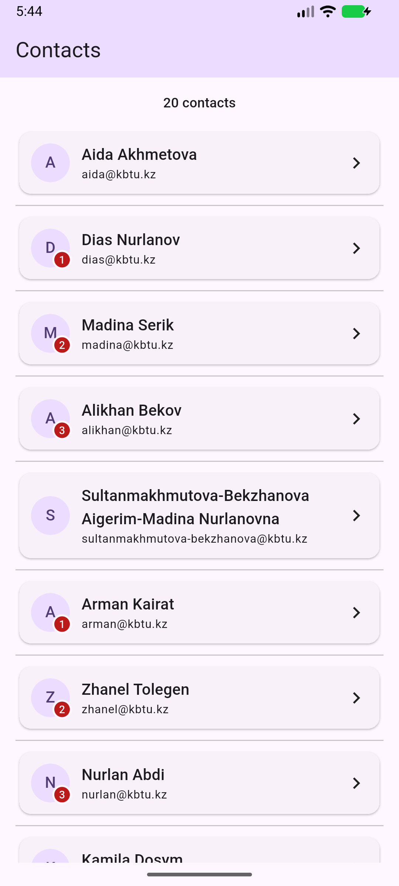
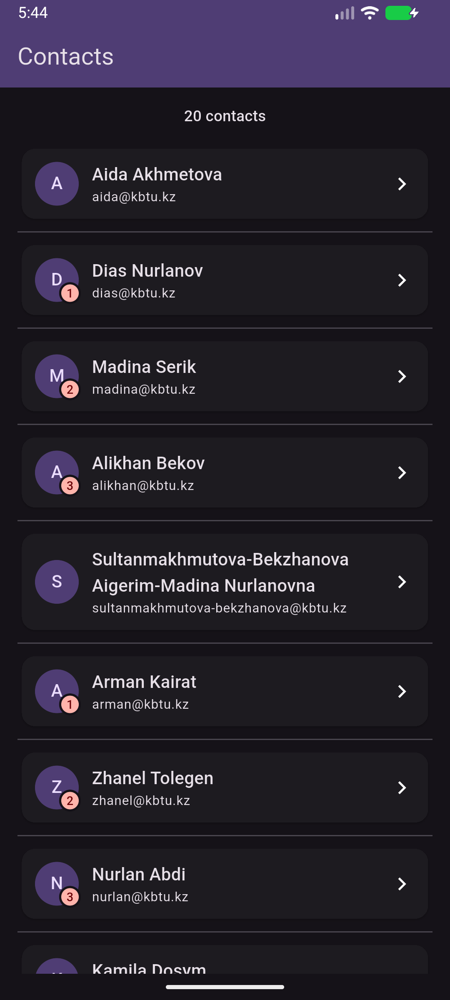
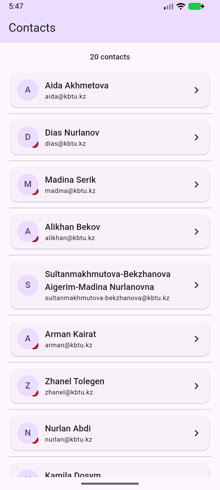

# flutter-2026-Daniyal

## Practice 5: A Screen That Never Overflows

Flutter-проект: [never_overflows](never_overflows/README.md).

Скриншоты с Android-эмулятора:

| Светлая тема | Тёмная тема | Обратный порядок Stack |
| --- | --- | --- |
|  |  |  |
